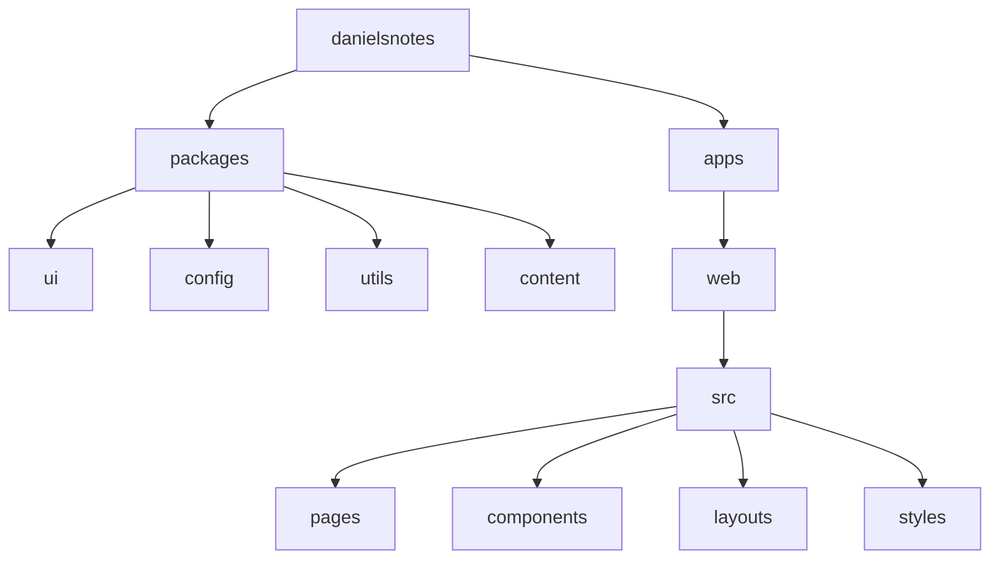
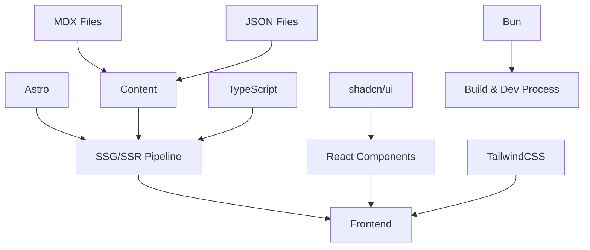

## Monorepo Structure

```mermaid
graph TD
    A[danielsnotes] --> B[packages]
    A --> C[apps]
    B --> D[ui]
    B --> E[config]
    B --> F[utils]
    B --> G[content]
    C --> H[web]
    H --> I[src]
    I --> J[pages]
    I --> K[components]
    I --> L[layouts]
    I --> M[styles]
```

## Technical Architecture

```mermaid
flowchart TD
    A[Astro] --> B[SSG/SSR Pipeline]
    B --> C[Frontend]
    D[React Components] --> C
    E[shadcn/ui] --> D
    F[Content] --> B
    G[MDX Files] --> F
    H[JSON Files] --> F
    I[TailwindCSS] --> C
    J[TypeScript] --> B
    K[Bun] --> L[Build & Dev Process]
```
